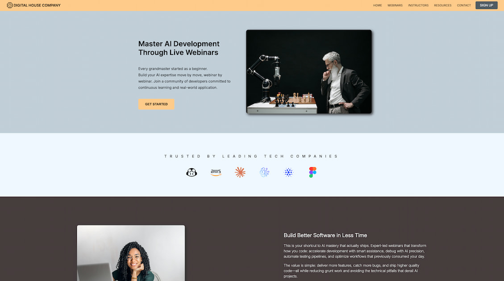

# Digital House Company

A responsive multi-page landing page for an AI development education platform, built with pure HTML5 and CSS3 — no frameworks.


<p align="center">
  
</p>

---

## Overview

Digital House Company is a fictional SaaS platform offering live webinars and resources to help developers integrate AI into their workflow. This project is a 5-page static website built as a frontend training exercise at EFP Brussels.

**Live Demo →** [View Site](https://thierrybwuzure.github.io/Saas-Website-Landing-Page/)

---

## Pages

| Page | Description |
|------|-------------|
| `index.html` | Homepage — hero, value proposition, benefits, testimonial, CTA |
| `webinars.html` | Webinar listings |
| `instructors.html` | Instructor profiles |
| `resources.html` | Learning resources |
| `contact.html` | Contact form |

---

## Features

- Fully responsive layout (mobile, tablet, desktop)
- CSS-only hamburger menu for mobile navigation
- Flexbox & CSS Grid layout throughout
- Semantic HTML5 structure
- Company logo showcase section
- Editorial content grid
- Testimonial and call-to-action sections

---

## What I Learned

- Building multi-page static sites with consistent navigation
- Structuring layouts with Flexbox and Grid without a CSS framework
- Creating a responsive hamburger menu using only HTML & CSS (checkbox hack)
- Semantic HTML and accessibility best practices

---

## Project Structure

```
Saas-Website-Landing-Page/
├── index.html
├── webinars.html
├── instructors.html
├── resources.html
├── contact.html
├── style.css
└── asset/
    ├── cpu.svg
    └── ...
```

---

## Author

**Thierry Bwuzure** — Junior Frontend Developer · Brussels, Belgium

[GitHub](https://github.com/thierrybwuzure) · [LinkedIn](https://linkedin.com/in/thierrybwuzure)
